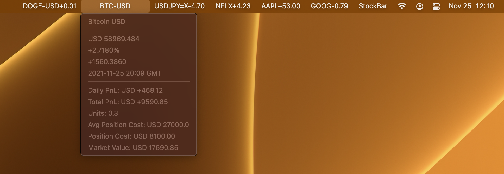
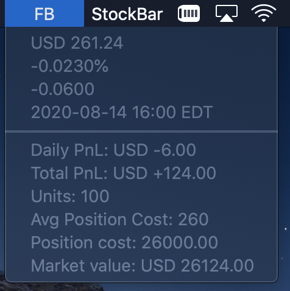
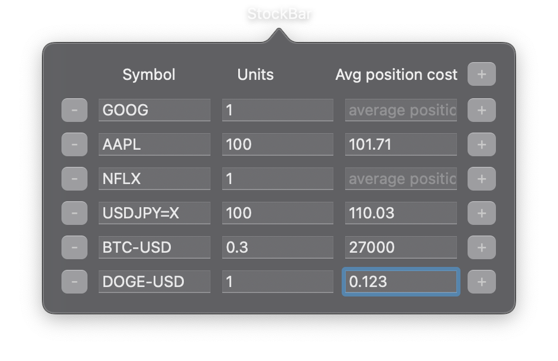

# StockBar

A menu bar app that tracks changes of stock prices, currency exchange rates, and cryptocurrency prices every minute.
The menu bar item displays the daily position changes if the unit size is provided in the settings. Otherwise, the per unit daily changes is displayed.

Click on the symbol name to show details such as the price, the change percentage, the last updated time stamp, and the position information. 

Some symbol examples are listed below. Please refer to https://finance.yahoo.com/lookup/ for more.

**Indices**:
* **^GSPC** : S&P 500
* **^N225** : Nikkei 225

**ETF**:
* **IVE** : iShares S&P 500 Value ETF

**Stock**:
* **AAPL** : Apple Inc
* **GOOG** : Alphabet Inc Class C
* **NFLX** : Netflix Inc
* **9626.HK** : Bilibili Inc
* **600519.SS** : Kweichow Moutai Co., Ltd

**Currency Exange**:
* **USDJPY=X** : 1 US dollar equals to X Japanese yen
* **USDCAD=X** : 1 US dollar equals to X Canadian dollar
* **EURCNY=X** : 1 Euro equals to X Chinese yuan(RMB)

**Cryptocurrencies**:
* **BTC-USD** : 1 Bitcoin equals to X US dollar
* **DOGE-USD** : 1 Dogecoin equals to X US dollar

## Preference
Provide the stock **symbols** to track in preference view. If unit sizes and average position costs are supplied, the open profit and loss will also be tracked. Click **StockBar** in the menu bar and select **Preference**. You may need to update the unit size and the average position cost after stock splits.

## API
* In use: [yahoo finance api](https://query1.finance.yahoo.com/v8/finance/chart/?symbol=AAPL&interval=1d). However, there is no official guide.
* Other apis:
    1. another yahoo api that can query multiple symbols at the same time. https://query1.finance.yahoo.com/v7/finance/quote?fields=symbol,shortName,priceHint,regularMarketPrice,regularMarketChange,regularMarketChangePercent,currency,regularMarketTime,fiftyTwoWeekHigh,fiftyTwoWeekLow&symbols=AAPL,GOOG
    2. [alphavantage](https://www.alphavantage.co). Free API key is available (By the time of writing, any string can be a valid free API key). However, the free API can only send five requests per minute. It only has end-of-day Nasdaq quotes.
